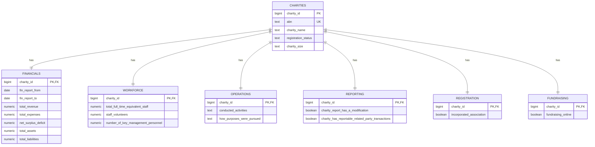

# Study Case 01 — Data Model

## Grain

The canonical entity grain is **one charity per ABN**.

## Entity / fact domains

- `acnc.charities` — canonical charity entity
- `acnc.operations` — activities and purposes
- `acnc.workforce` — staff, FTE, volunteers and KMP
- `acnc.financials` — revenue, expenses, assets and liabilities
- `acnc.reporting` — reporting/compliance attributes
- `acnc.registration` — incorporation and state registration
- `acnc.fundraising` — fundraising registrations

## Keys

- Source business key: `abn`
- Curated surrogate key: `charity_id`
- Source lineage key: `source_id` / `source_load_id`

## System metadata

Raw/staging:
- `source_load_id`
- `source_file`
- `source_loaded_at`
- `etl_batch_id`

Curated:
- `source_file`
- `etl_batch_id`
- `created_at`
- `updated_at`
- `record_hash`

## Mermaid ERD

